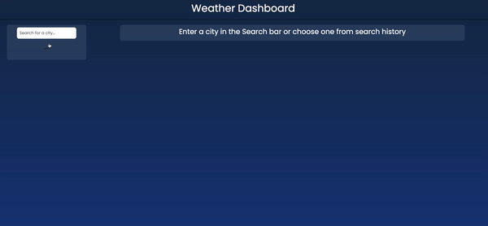

# Kavya's Weather Dashboard

## Javascript - Module 6 Challenge

## Table of Contents

- [Description](#description)
- [Technologies](#technologies)
- [Deployed Link](#link)
- [Usage](#usage)
- [User Information](#userinformation)
- [Credits](#credits)
- [License](#license)

## Description

A weather dashboard where a city can be searched for and saved in order to view the details of the current weather and the next 5 days. Once a city is searched for, it'll be saved on the page and can be viewed with a click of a button.

## Technologies

- HTML
- CSS
- Bootstrap
- JavaScript
- jQuery

## Deployed Link

[Deployed Link](https://smandla.github.io/weather_dashboard/)

## Usage

### Website Demo

### Code Snippet

#### Code snippet that changes the display for the current weather section

## User Information

[LinkedIn](https://www.linkedin.com/in/srikavya-mandla/) |
[Portfolio](https://smandla.github.io/kavya_professionalportfolio/)

## Credits

Credits to University of California, Berkeley.

## License

---

© 2022 Trilogy Education Services, LLC, a 2U, Inc. brand. Confidential and Proprietary. All Rights Reserved.
